# Mint a FREE NFT on the Rinkeby testnet and view it on Open Sea!

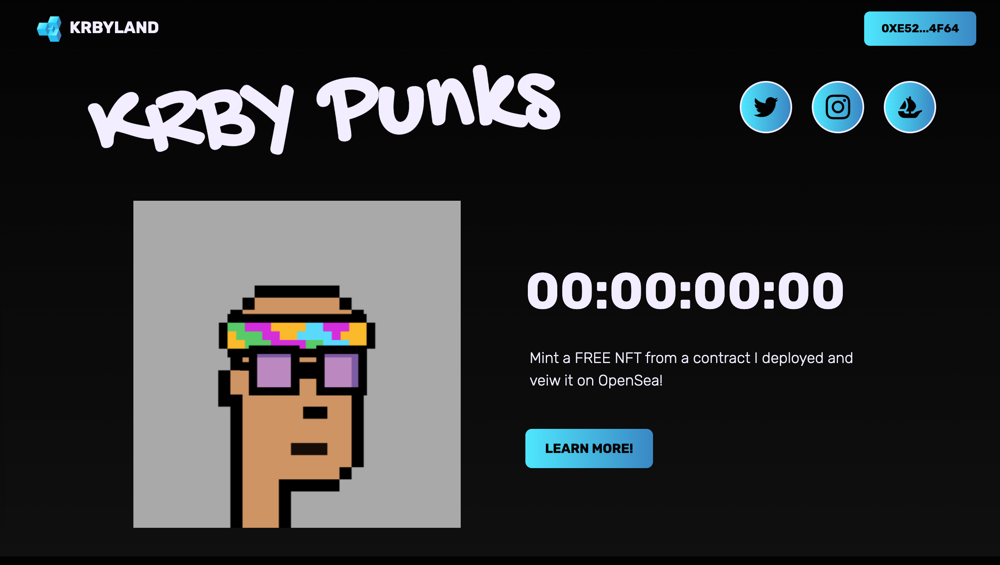

## Before you can mint on Rinkeby, you will need to grab yourself some free test ETH!
### Click the link below and open the link in another tab! 
[Get your free test ETH here](https://faucets.chain.link/rinkeby)

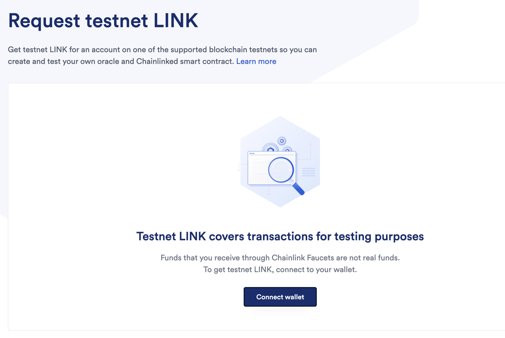
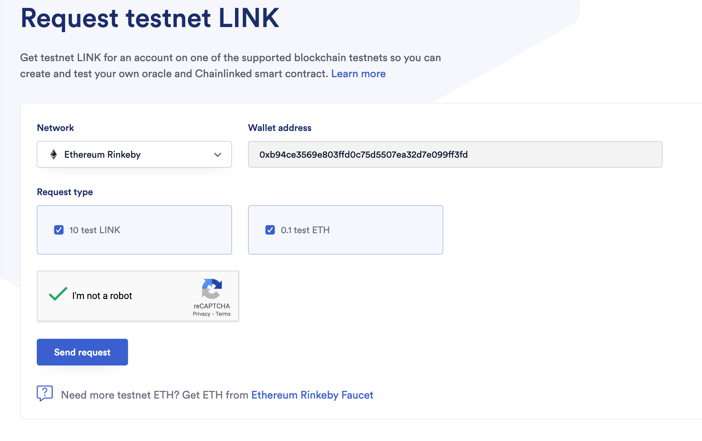
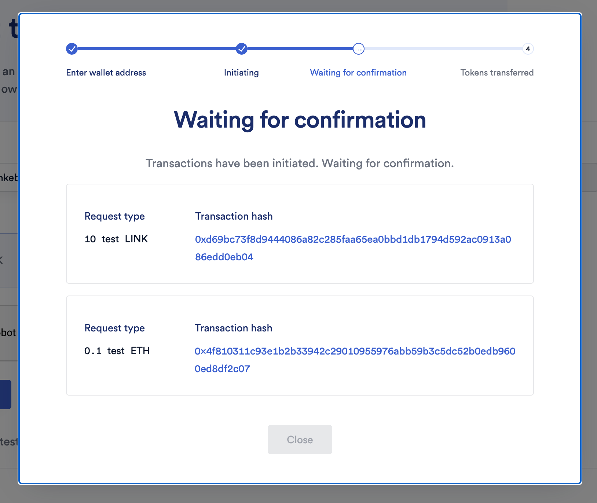
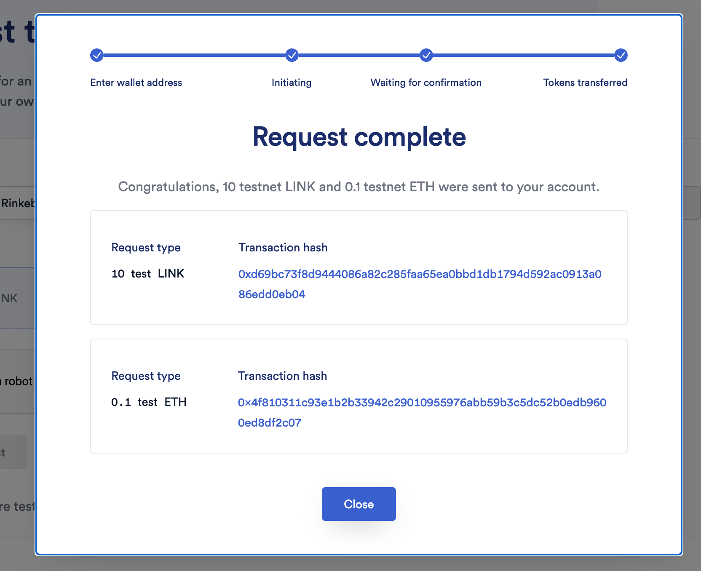

# Now you are ready to mint!
## Open the link below in another tab...

[Mint your FREE NFT here!](https://small-lake-3458.on.fleek.co/)

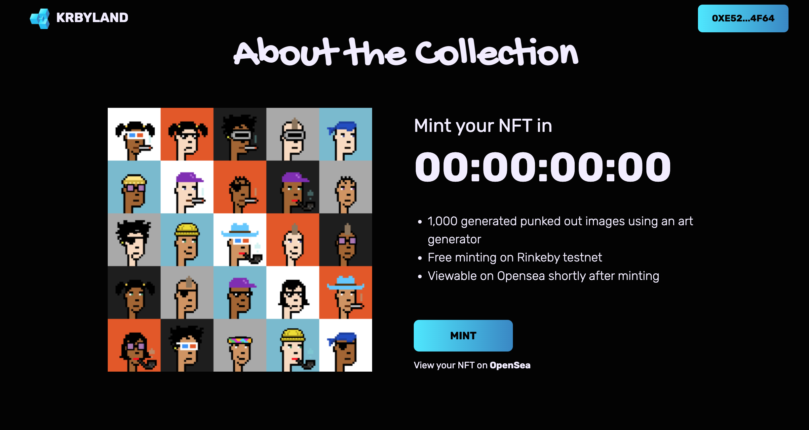

# Make sure you are on the rinkeby network in Metamask...
## (If network isn't visible click on show/hide test networks at the top)

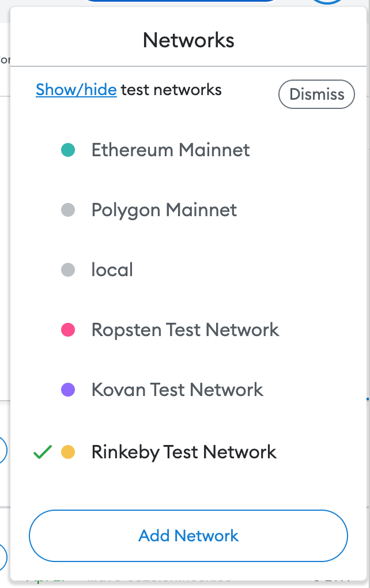

# Scroll down to where you find the mint button...
<!---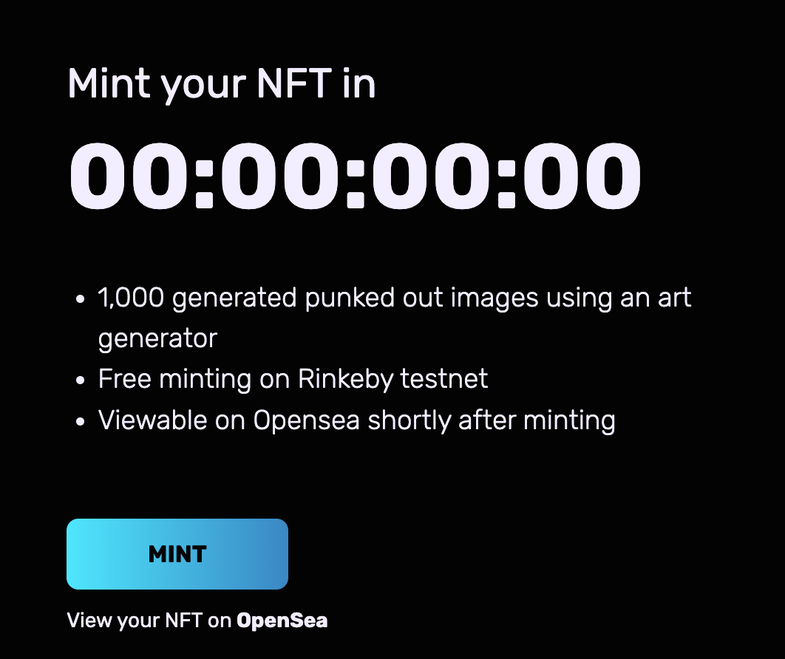--->
 

# ...and click!!!
 
 

## Make sure you click "confirm" in the pop-up window!

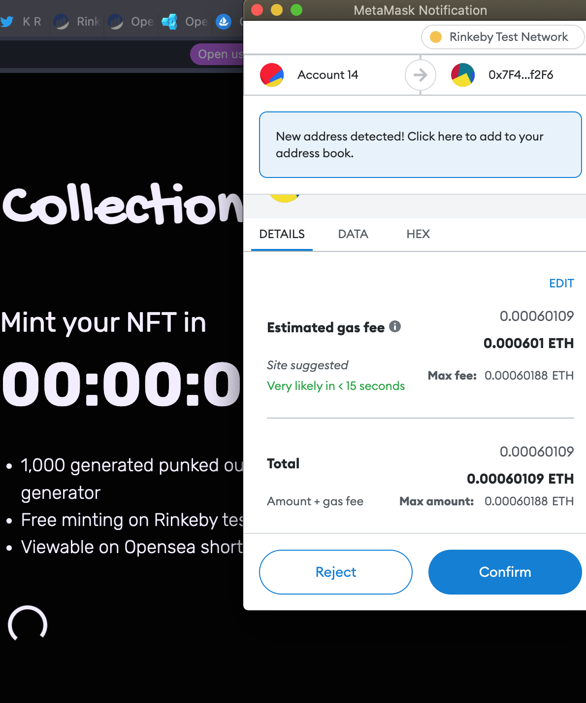

## Once the transaction is compelete click "View your NFT on Open Sea"

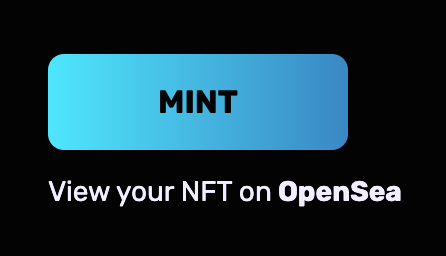

 

# Your NFT should be veiwable shortly on Open Sea!

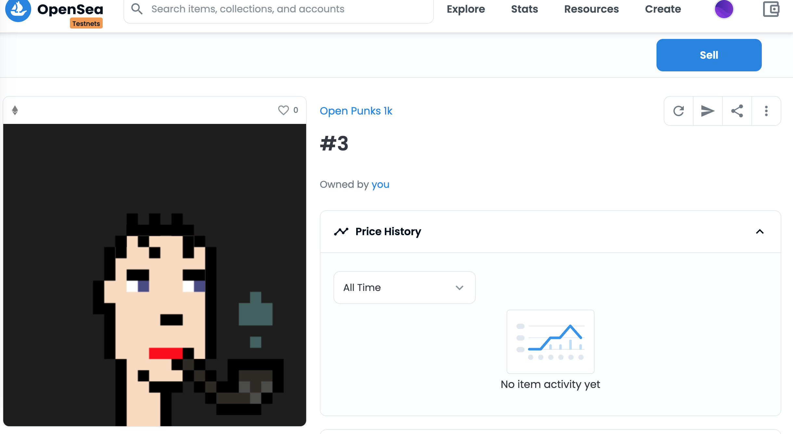
 

# Now you are ready!

[CLICK HERE TO MINT YOUR FREE NFT!](small-lake-3458.on.fleek.co/)

 

